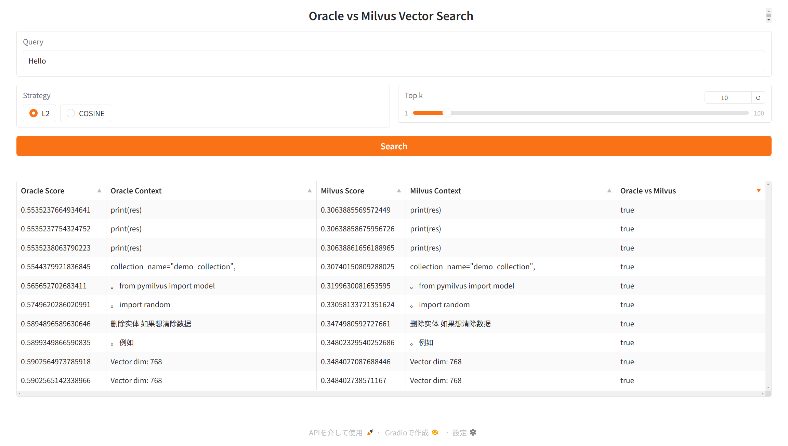
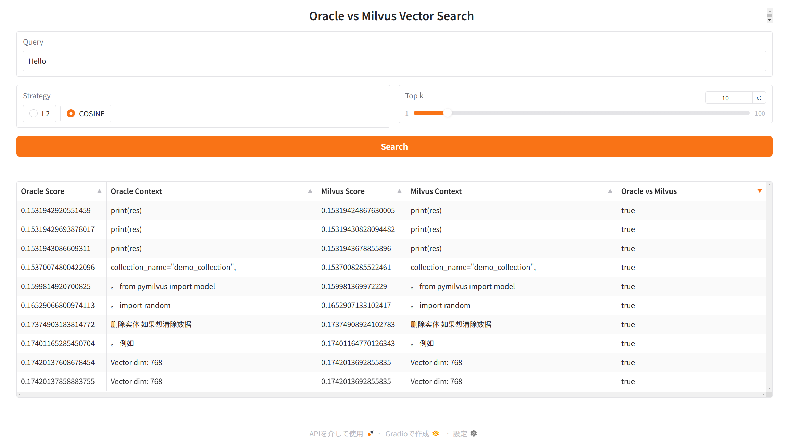

# Oracle Database vs Milvus

## Install

```shell
conda create -n oracle-vs-milvus python=3.11 -y
conda activate oracle-vs-milvus
```

```
pip install -r requirements.txt
# pip list --format=freeze > requirements.txt
```

```
cp .env.example .env
```

## Run

```
python app.py
```

## Use

Open [http://127.0.0.1:7860](http://127.0.0.1:7860)




